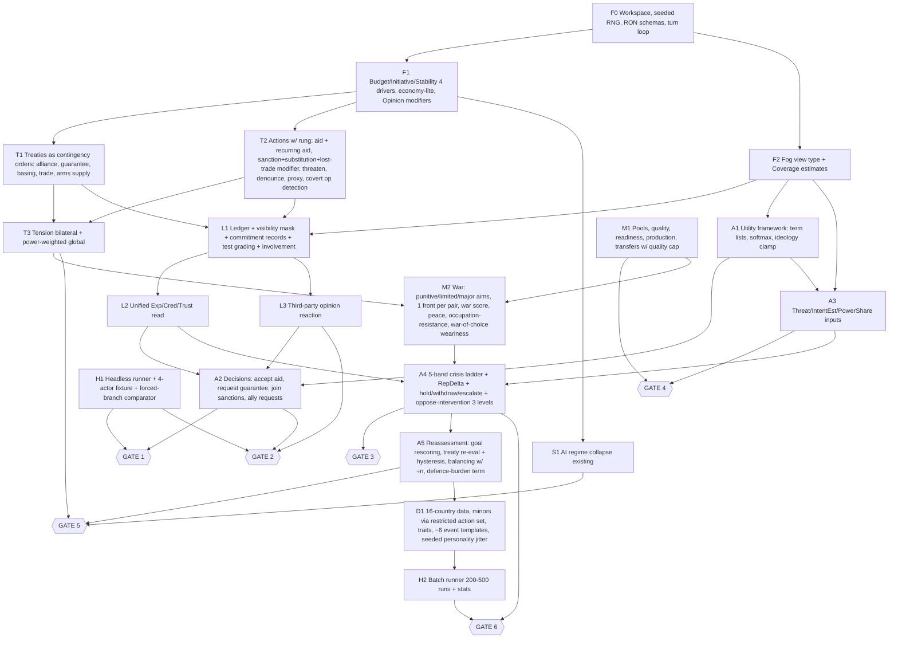

# Agent 5: Minimal-Implementation Reviewer

**Objective:** get to the first complete, playable 1980–2000 campaign as fast as possible, with gates 1–6 passing. Historical accuracy is not a reason to build anything.

## Verdict

The three agents broadly agree on one new primitive: the shared ledger, plus per-observer reads of it. That primitive is the right core. Two problems need fixing before anything is built.

1. **There are two competing reputation formulas.** Agent 1 uses an additive Cred(O,A). Agent 4 uses a beta-mean with a 5-feature similarity kernel. Pick one. For v0.1, ship a **pseudo-count weighted average with a 3-tier relevance weight**. It is described in §2.
2. **Agent 4's AI layer is about 2× what the gates need.** It has 11 ladder levels, 17 inputs, 9 decision utilities and 18 tests. Gates 1–6 pass with 5 levels, 10 inputs, 6 decisions and 10 tests.

**Order change:** Gate 4 (blowback) is cheaper than Gate 3 and needs no war system, so build it before Gate 3.

Key to the classes used below:
- **CORE** = v0.1, required.
- **DEF** = deferred.
- **SCN** = scenario layer, meaning data, traits, events or treaties with no engine change.
- **CUT** = not worth building.

---

## 1. Classification

### 1.1 Agent 1 (Core Systems)

| Mechanic | Class | Reason |
|---|---|---|
| N1 Event Ledger (single, append-only, sim-owned) | **CORE** | Gates 1, 2 and 4 all read it. Replacing §14.6 memory and the stored Credibility value removes state rather than adding it. |
| Ledger visibility: Public/Covert + `known_by` bitmask | **CORE** | Covert-vs-exposed is the whole domestic-exposure mechanic. A 16-bit mask is trivial. |
| Commitment records + test grading (honour / partial / abandon, K = 2) | **CORE** | This is how "past behaviour" enters the game (Gate 1). |
| Withdraw-in-tension = abandon ×0.5; withdraw in calm ≈ free | **CORE** | One branch. It stops withdrawal from being used as a free escape. |
| Cred(O,A) derived per observer | **CORE**, simplified | Use the unified formula in §2, not either agent's full version. |
| Relevance weights (beneficiary / same-kind holder / shares region-alignment-govtype / other) | **CORE**, 3 tiers | Merge "same-kind holder" into "like me". Three tiers produce the observer divergence Gate 2 needs. |
| Third-party opinion reaction (α·Opinion(O→B) + β·affinity) | **CORE** | This is what makes "help one partner, hurt another" (Gate 2). It is one formula. |
| Denounce cites a covert entry to expose it | **DEF** | Detection-roll exposure is enough for v0.1. Add this once propaganda is shown to matter. |
| Domestic exposure hit × govDistance | **CORE-lite** | Ship a flat Legitimacy hit, weighted by government type (the existing Spy scandal). Drop the govDistance multiplier. |
| Trust as a ledger query restricted to E | **CORE** | Same query with a different filter, so no new store. |
| `rung` attribute on every action + tabulated cost profile | **CORE** | This gives Gate 3 its options without a doctrine system. |
| `Punitive` war aim (air/naval, auto-ends in 1–2 ticks) | **CORE** | This is Gate 3's "limited military" option, and it is cheaper than a front war. |
| Punitive strike against an arsenal programme (absorbs P9) | **DEF** | Depends on P10. |
| Auto involvement commitment at rung ≥ 4 | **CORE** | Entanglement emerges from it. Gate 6's "accepts losses" needs a cost to withdrawing. |
| Per-crisis involvement readout | **DEF** (UI) | Headless log line only in v0.1. |
| Transfer = move strength between pools | **CORE** | Gate 4 passes by construction. |
| Quality blend capped at recipient tech + 2 | **CORE** | One line. Without it, transfers become quality laundering. |
| Advisors as a temporary quality bonus | **CORE** | It already exists in §11.5. |
| Training (+1 quality, 8-turn decay) | **CUT** | Duplicates advisors. |
| Aid earmarked for infrastructure | **DEF** | Persistent capability is already covered by pools. |
| Sanction scope: trade, commodity | **CORE** | It already exists. |
| Sanction scope: technology, finance | **DEF** | Needs research diffusion and debt-service work. Debt is on probation. |
| Sanction substitution `sub_t` | **CORE** | It is the anti-spam fix, and it is about four lines of code. Agent 2 proposes the same thing. |
| Sanction-breaker opinion bonus | **DEF** | Flavour on top of substitution. |
| Sanctioner's lost trade becomes a visible Prosperity modifier | **CORE** | This is Gate 2's "costs money / domestic". It generalises Breadbasket and Exposed Sectors cheaply. |
| Trade Agreement `depth` 1–3 + adjustment shock | **DEF** | The 1990s integration story. Not needed for any gate: Gate 5 has enough levers without it. Interdependence already emerges from trade share. |
| Patronage = recurring Aid + Arms (P4 merged) | **CORE** as a "recurring Aid" standing order | Anti-tedium, and Dep = aid ÷ revenue falls out of it. |
| Periodic treaty re-evaluation | **CORE** | This is Gate 5. "Allies question old alliances" comes from this alone. |
| Defence-burden tolerance term | **CORE** | One Legitimacy term gives peace-dividend pressure without an event (Gate 5). |
| War-of-choice weariness multiplier | **CORE** | One term. Vietnam Syndrome becomes trait data. |
| Global Tension weighted by power-share product | **CORE** | One formula change. It is era-safe and makes the post-rival calm automatic. |
| N2 Public Stances / norm tests | **DEF** | Agent 1 agrees. Add it only if Gate 2 playtests show selective enforcement is illegible. |
| N3 Supplier dependency (spare parts) | **DEF** | Gate 4 passes without it. |
| Credibility overlay + top-3 precedents | **CORE** as a log string, **DEF** as UI | The reasoning log must print the top 3 entries (Principle 9). It is cheap if built in from the start. |

### 1.2 Agent 2 (US gameplay)

| Mechanic | Class | Reason |
|---|---|---|
| Reserve Currency trait | **SCN** | v0.1 = a cheap-borrowing modifier only. Rate-setting waits for P7. |
| Global Commitments trait | **SCN** | Starting treaties and bases are data. |
| Expeditionary Democracy trait | **SCN** | It is the `c` parameter of war of choice. |
| Breadbasket trait | **SCN** | A multiplier on the lost-trade Prosperity modifier. |
| Exposed Sectors | **DEF** | The cheaper form, the lost-trade Prosperity modifier, is CORE. |
| Integration Treaty | **DEF** | Same as depth. |
| Conditional packages (freeze programme, etc.) | **DEF** | Needs verification, breach detection and a new grading path. It is a real feature, but not v0.1. |
| Requests from allies (refusal costs Trust) | **CORE** | It reuses the treaty-proposal type. It is how the AI pulls the player into commitments, and Gate 1's "request a guarantee" needs it. |
| Host resentment of bases | **CUT** (v0.1) | It can be faked later with an opinion modifier on Basing. |
| "Credibility moves only on public commitments" | **CORE** rule | Free, because tests fire only on commitments. It keeps restraint viable (D10). |
| Secondary sanctions, burden-sharing, exclusion zones | **SCN**/existing | These are just combinations of existing actions. |
| Monetary stance | **DEF** | Depends on P7. |
| SDI | **SCN** | National project data. |
| Election cycle personality shift | **SCN** | An event template (P11). |
| Dilemmas D1–D10 | **SCN** + **test fixtures** | They are emergent situations, not content to script. Use D6 (seizure) and D1 (conduit, without P10) as forced-branch fixtures for Gates 2–3. |

### 1.3 Agent 4 (AI)

| Mechanic | Class | Reason |
|---|---|---|
| CommitmentRecord kinds Defend / Threat / Support / Norm | **CORE: 2 kinds** | Back (Defend + Support + involvement) and Threat. Norm is deferred along with Stances. |
| Beta-mean + 5-feature similarity kernel | **Over-engineered** | Replace with the unified formula in §2. |
| ExpDefend, ExpThreat | **CORE** | These two reads are Cred. |
| ExpAbandon (projected value-to-P) | **DEF** | Needs ValueToP. Gate 5's wobble comes from the "lost purpose" term. |
| Selectivity | **DEF** | Needs Norm records. |
| Threat trend term | **DEF** | Only "primacy vs. a rising rival" needs it. Gate 5 needs about 3 viable strategies, not 6. |
| SharedRival, Dep, Leverage, IdeoDist, Need, Opinion, Trust, Treaties, Goals, Pers | **CORE** | Each is a cheap derived value or already exists. Dep = max(trade share, aid share) only. |
| PowerShare_E | **CORE-lite** | Global power share × a crude reach factor (same region, or owner has basing there). Defer full projectable-power accounting. |
| IntentEst | **CORE-lite** | Decayed count of P's coercive and war entries against *anyone*. Drop "against states similar to E". It is the main anti-dogpile term, so it cannot be cut. |
| AssocCost | **CUT** as a separate input | Merge into the bounded ideology term. |
| ValueToP, Entrap | **DEF** | Refinements. |
| Accept aid (2.1) | **CORE** | Gate 1. |
| Accept bases (2.2, tripwire term) | **DEF** | Use the generic §7.5 treaty utility. The tripwire term is clever but not needed. |
| Join sanctions (2.3) | **CORE** | Gate 3 sanctions coalition, Gate 6 coercion. Drop the Selectivity and Norm-fit lines. |
| Oppose intervention (2.4), 6 levels | **CORE: 3 levels** | none / denounce / arm the target. Denying bases and pacts reuse the generic paths. |
| Request guarantee (2.5) | **CORE** | Gate 1. |
| Abandon bloc (2.6) + hysteresis | **CORE** | Gate 5. Hysteresis is two lines and prevents flip-flopping. |
| Balance against power (2.7) | **CORE** | Feeds the existing goal. Needed for the anti-dogpile test. |
| Exploit inconsistency: Probe | **CORE** as an input | Feed Cred into the existing §14.3 Opportunity score. No new action family. |
| Exploit inconsistency: Propaganda, Bid up loyalty | **DEF** | Need Selectivity / ValueToP. |
| Remain aligned: ideology discount under threat | **CORE** | One multiplier inside 2.6. |
| Explanation list = term list | **CORE** | Principle 9. It is nearly free if the utility function returns `Vec<(label, value)>`. |
| Crisis ladder, 11 levels (3.1) | **CORE: 5 levels** | See §2. |
| RepDelta via hypothetical ledger record | **CORE** | It is the key coupling. It is cheap at 16 observers × 1 query. |
| Hold / withdraw / escalate, sunk-cost-free (3.2) | **CORE** | Gate 6's "accepts losses". |
| Economic-coercion leverage term (3.3) | **CORE** | Simple `f(Leverage, coalitionShare, sub_t)`. |
| Post-rival goal rescoring (3.4) | **CORE** | It is the existing reassessment. |
| Personality drift via P11 | **SCN/DEF** | v0.1 uses seeded ±0.1 personality jitter at campaign start instead. |
| Softmax over top-3 near-ties | **CORE** | Cheap source of Gate 6 variety. |
| Anti-dogpile: intent multiplier, ÷n balancers, bandwagon | **CORE** | One multiply, one divide. Bandwagoning falls out of the guarantee/align utility. |
| Anti-ideology-lock: clamp, discount, per-decision weights | **CORE** | Three constants. |

### 1.4 Scenario P1–P12

| # | Class | Reason / cheaper form |
|---|---|---|
| P1 Tiers / bloc minors | **CORE-lite** | **Don't build a separate rules engine.** Minors run the *same* utility AI with a data-restricted action set (accept/refuse, request guarantee, align, exit). This is cheaper than a second AI. Bloc minors and unmodelled states are SCN. |
| P2 Region loyalty & secession | **DEF** | Runtime country spawning is expensive. AI regime collapse covers Gate 5. |
| P3 Regime transition | **DEF** | Collapse covers Gate 5. Add this when the USSR or South Africa as *player* countries matter. |
| P4 Patronage treaty | **CUT** | Becomes the recurring-Aid standing order. |
| P5 Commodity production policy | **DEF** | The market works without it. Revisit if the oil-swing target (E.3) fails. |
| P6 Chokepoints Open/Contested/Closed | **DEF** | v0.1 ships binary Open/Closed through sea control only. |
| P7 World Interest Rate | **DEF** | A new global variable on top of Debt, which is itself on probation. |
| P8 Outposts | **SCN** | A basing treaty with a tiny host region or minor. |
| P9 Counter-proliferation strike | **DEF** | Absorbed into the Punitive aim once P10 exists. |
| P10 Covert programmes / declaration | **DEF** | Nice for fog, but no gate needs it. |
| P11 Leadership change | **SCN** | An event template whose effect is a personality-vector delta. Needs no engine work beyond generic event effects. |
| P12 Event templates | **CORE** (engine), **SCN** (content) | A parameterised event engine is cheaper than ad-hoc events. v0.1 ships about 6 templates, not 15. |

**Foundation trims** (outside the brief, but they block "complete campaign"; flagged for the user):
- **Nuclear (D14):** v0.1 = arsenal level as a deterrence and EscalationRisk input, plus one "use" action with the catastrophic penalty package. The 3 use scales and the Nuclear Winter meter come later.
- **Fronts:** one front per belligerent pair, not per border segment.
- **National projects:** SDI only, as data.

---

## 2. Cheaper v0.1 forms of the over-engineered items

### 2.1 Unified reputation read (replaces both Agent 1's Cred formula and Agent 4's beta-mean)

```
Exp_k(E,P) = (n0·prior_k(P) + Σ w_i·s_i) / (n0 + Σ w_i)      k ∈ {Back, Threat}
  s_i = 1 honoured, 0.5 partial, 0 abandoned        (entries E can see)
  w_i = 0.5^(age/20) × rel(E,i) × (1 + cost_paid_i) × (abandon ? 2 : 1)
  rel = 1.0 E was beneficiary/target | 0.5 shares region OR alignment with beneficiary | 0.2 other
  n0  = 3 (data); prior from scenario
Cred(E,P) = 100·Exp_Threat-or-Back as context requires; Trust(E,P) = same with rel ∈ {1, 0}
```

- Agent 4's similarity kernel collapses to two features, region and alignment, inside `rel`.
- The ×2 on abandonment keeps Agent 1's "fast to lose" property.
- This passes Agent 4 test 6 (Gate 1) and test 2 (divergence) when the fixture places the honoured and abandoned clients in different regions or alignments.
- **Escalation rule:** if Gate 2 playtests show players can't tell why A and B disagree, add the value-to-P band as a third `rel` feature. Do not start with it.

### 2.2 Ladder: 5 bands, not 11 levels

The bands map one-to-one onto Gate 3's options. The AI picks a band, then the concrete action inside it.

| Band | Concrete actions (existing) | Visibility | Involvement stake |
|---|---|---|---|
| 0 None | Mediate optional | — | 0 |
| 1 Coerce | Threaten, Sanction, Embargo | Public | 0.3 (only if an ultimatum is issued) |
| 2 Proxy | Arm insurgents / Arms / Advisors / Volunteers | Covert → exposable | 0.5 |
| 3 Strike / limited | Punitive aim, or limited-aims war | Public | 1.0 |
| 4 Major | Coalition or regime-change war, plus occupation | Public | 1.5 |

The `rung` attribute stays on actions for tension and cost purposes. The AI just reasons in bands. The 11-level table returns only if band-internal choices prove too coarse.

### 2.3 Tests: 10 for v0.1, not 18

Keep these Agent 4 tests:

| Test | Covers |
|---|---|
| **1** | No identity branching: lint plus data-swap permutation |
| **2** | Observer divergence (G2) |
| **3** | Fog respect |
| **6** | Past behaviour matters (G1) |
| **7** | Explanation integrity |
| **14** | Blowback (G4) |
| **15** | Post-rival rescore (G5). Relax to "≥ 3 strategies above 10%" over 200 seeds |
| **16** | Gate 6 variety, over 200 runs |
| **18** | Determinism |

Add one new test:

- **New test F: forced-branch Pareto test (G2, G3).** Clone the world at a fixture crisis (D6 seizure, D1 conduit). Apply each option, run 8 turns, and record the vector {security, budget, opinion of DA, opinion of NA, Cred(DA), Stability}. Pass condition: **every option is best on at least one metric and no option is best on all.**
  - This is the cheapest objective form of "no universally superior answer."
  - It replaces 5, 12 and 13 as gate evidence.

Deferred: 4, 8, 9, 10, 11, 12, 13, 17.
- Run 10 (no dogpile) as a smoke statistic in batch output, not a CI gate.
- 5 waits for Norm records.
- 17 is mostly covered by test 1's permutation.

---

## 3. Dependency graph of V0.1 CORE



### Gate unlock table

| Gate | Needs (CORE items) | Evidence |
|---|---|---|
| **G1** One interaction | F0, F1, F2, T1, T2, L1, L2, A1, A2, H1 (4-actor fixture) | Tests 1, 3, 6, 7, 18 |
| **G2** Contradictory incentives | G1 + L3 + lost-trade modifier + Dep | Test 2 + forced-branch F (conduit) |
| **G4** Blowback | M1 + A3 (Threat reads recipient strength) + L1 | Test 14 |
| **G3** Escalation | M1, M2, T3, A4, involvement commitments | Forced-branch F (seizure) |
| **G5** Post-rival | A5 + S1 + power-weighted tension + defence-burden + war-of-choice | Test 15 (fixture: delete or collapse the rival at turn 0) |
| **G6** AI both sides | Everything + D1 + H2 + softmax | Test 16 |

---

## 4. Build order

1. **Skeleton (F0–F1).** Cargo workspace, `rand_chacha`, RON schemas for country, region, treaty and trait, then the quarterly turn loop with Budget, Initiative and Stability, a 3-commodity economy-lite, and Opinion modifier lists. Run 80 empty turns deterministically.
2. **Fog type (F2) now, not later.** The AI crate must compile against `FogView` from day one, or the "no cheating" rule gets retrofitted. Coverage can start crude, as a fixed band width per tier.
3. **Treaties + rung-tagged actions + tension (T1–T3).** Include sanction substitution and the lost-trade Prosperity modifier from the start. They are trivial now and painful to add later.
4. **Ledger + reputation + third-party reaction (L1–L3).** Use the unified formula. The reasoning log prints the top 3 entries.
5. **AI framework + 4 decisions (A1–A2) + 4-actor fixture + forced-branch harness (H1).** **Gate 1, then Gate 2.**
6. **Military pools + transfers (M1) + threat inputs (A3).** **Gate 4.** This is a few days of work and it validates the persistent-state principle early.
7. **War-lite + 5-band ladder (M2, A4).** Build Punitive first, because it is the cheapest war. Then limited, then major with occupation and resistance. **Gate 3.**
8. **Reassessment, treaty re-evaluation, balancing, defence burden, power-weighted tension (A5).** **Gate 5** via the delete-rival fixture.
9. **Full 1980 data (D1).** 16 countries, minors as restricted-action AIs, traits as data, about 6 event templates: Leadership Change, Spy Scandal, Peace Dividend, Debt Default, Diversionary Claim, Hostage Crisis. Then the batch runner (H2). **Gate 6**, plus the E.3 plausibility targets as non-blocking stats.
10. **Only then:** pull from DEF by evidence. Likely order:
    - Trade depth and integration (if the 1990s feel flat)
    - P2/P3 (if USSR outcomes skew)
    - P5/P7 (if the oil and debt targets miss)
    - Stances/Selectivity (if selective enforcement is illegible)
    - Conditional packages
    - UI

**Scope check:** v0.1 adds 1 new data structure (the ledger), 1 read function, 1 opinion rule, 4 one-line Stability/tension terms, 1 war aim, 1 sanction parameter and 1 standing order. It adds 0 new currencies, 0 US-specific code and 0 new AI subsystems (minors reuse the main AI). Everything else in the three proposals is deferred, scenario data, or cut.
